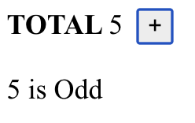

= Exercises on React state management

== Introduction

This document contains a set of exercises about React state management.

== `Counter` component

Create a `Counter` component with the following _props_ type in a file `counter.js`.
[source, typescript]
----
type CounterProps = {
  label: string;
  onIncrement?: (newValue: number) => void;
};
----
This component should present:

* A textual label.
* A counter value, initialized with zero.
* A button to increment the current value.

If `onIncrement` is present in the _props_ object, then this function should be called every time the counter is updated.

Test the `Counter` component in a separate React component that displays the
text "even" or "odd" depending on the current counter value. The displayed text
should update dynamically as the counter value changes, as shown in the
following example.

== `InputBox` component

Create an `InputBox` component with the following _props_ type.
[source, typescript]
----
type InputBoxProps = {
  label: string;
  minLength: number;
  maxLength: number;
  onSubmit: (value: string) => void;
};
----
This component should present:

* The provided label.
* An `input` element with type `"text"` to collect a string.
* A submit button to submit that string.

The submit button should only be enabled when the input contents satisfy the `minLength` and `maxLength` requirements.

When the submit button is clicked, the `onSubmit` function should be called with the input's content.

An error message should be shown when the input is not empty and does not satisfy the `minLength` and `maxLength` requirements.

Test the `InputBox` component in a new React Component that displays the number
of submissions (incremented only on valid submissions) and the value of the last
submitted input (updated only on valid submissions).

== `CounterList` component

Create a component with an empty _props_ type to show a list of counters.
This component should present: 

* A list with all counters, including a button to remove each counter.
* An `InputBox` to receive a counter label.
When this input box is submitted, a new counter should be created with that
label and added to the list.
* The sum of all the counter values.

Implement this component using the `useReducer` hook.
The state should have the `State` type.
[source, typescript]
----
// State for an individual counter
type CounterState = {
  label: string;
  value: number;
};
// State for the complete component
type State = {
  sum: number;
  counters: Array<CounterState>;
};
----

The following `Action` type defines the possible actions:

[source, typescript]
----
// Type of the possible actions
type Action =
  | { type: "addCounter"; label: string }
  | { type: "removeCounter"; index: number }
  | { type: "valueUpdate"; index: number; newValue: number };
----

Start by defining the reducer function, then define the component.
